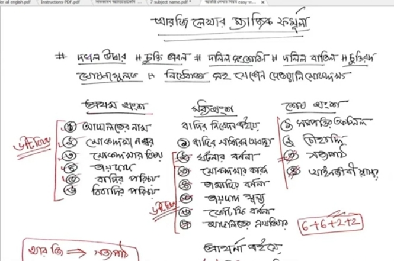
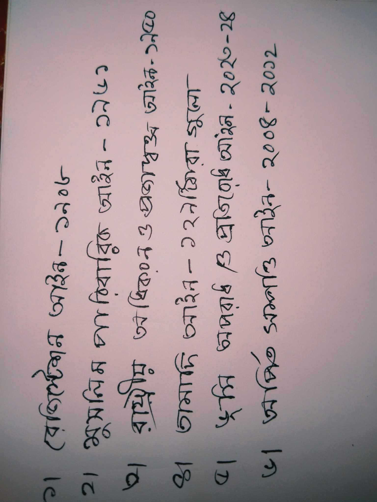
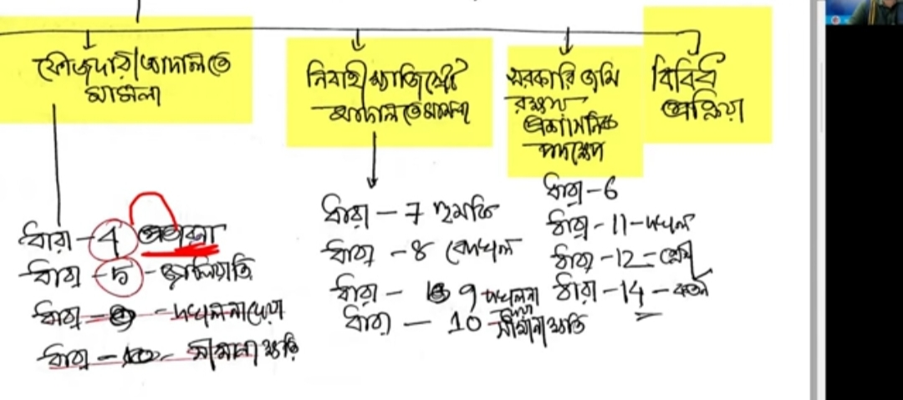

## ফৌজদারি -- মারামারি খুন
## দেওয়ানি --- জমি সংক্ষান্ত

G.R
General Register
থানার FIR মামলা
C.R
Complaint Register
সরাসরি কোর্টে অভিযোগ
M.R
Miscellaneous Register
সহায়ক/আবেদন মামলা
N.I
Negotiable Instruments
চেক বাউন্স মামলা
L.S.T
Land Survey Tribunal
জমির রেকর্ড সংশোধন
আপনি চাইলে আমি আরও বিস্তারিত বলতে পারি:

<!--[profile](./a.jpg)-->

# Ainer-dara-jomi

(1) অধিগ্রহন আইন যদি S.a থেকে R.s রাস্তা নিয়ে যাই। ম্যাপের ডান পাসে লেখা থাকে তাখলে রাস্তা ছেড়ে দিতে হকে।

 L.D শাখা তথ্য পাবেন ম্যাপে অিধগ্রহন করে নিয়ে গেছে নাকি।

 ## সুনির্দিষ্ট প্রতিকার মোট দারা ৫৭ টি

 (১) থাবর স্থাবর সম্পত্তি দখল পূর্ন উদ্দারর ৮-১১ সেকশন

 (২) সুনিদিষ্ট প্রতিকার বাস্থবায়ন আইন ১২-৩০

 (৩) দলিল শংসুদন আইন ৩১-৩৪

 (৪) চুক্তি রত ৩৫-৩৮

 (৫) দলিল বাতিল আইন ৩৯-৪১

 (৬) গুসনা মুলক প্রতিকার আইন৪২-৪৩

(৭) রিসিবার নিয়োগ ৪০ [ ৪৪ থেকে ৫১ নাই বইয়ে ]

(৮) নিশেদাঙ্গা  আইন --৫২-৫৭
 
 

 (৪) 
 

(২) সুনির্দিষ্ট প্রতিকার আইন ৪৯ দারা

(3)১০৭ দ্বারা মুছলেখা। যদি কোনো ব্যাক্তি রাস্তা/পুকুর খন করতে চাই যোর করে আপস ছাড়া।

## তামাদি আইন মোট দাারা ২৯ টি= তামাদি শব্দের অর্থ সময়। খারিজ হয়ে যাওয়া মানে মামলা শেষ হয়ে যাওয়া। 

তামাদি আইন উপমহাদেশে শুরু হয় ১৮৫৯ সালে। কার্য কর হয় ১৮৬২ সাল থেকো।

## যে আইন গুলো জান্তে হবে 

<!--[profile](./jomi.jpeeg)-->

## সম্পত্তি হস্তান্তর আইন ১৮৮২ ধারা:- ১৩৭

ধারা:-৫৪
ধারা:-৫৮
ধারা:- ১১৮
ধারা:- ১২৩

## সেকশন ৪৭ কার জমি আগে টিকবে তা লিখা আছে।

রেজিস্টেশন আইন সেশন ৪৭ কি বলা আছে বিস্তারিত ব্যাক্ষা সহ? --chatgpt

## G.R বাদি মামলা---[ থানায় করা হয়]

(১)  FIr হয় 

(২) পুলিশ তদন্ত করে সার্সিট দেয় আদালতে পরে আতালত বিচার করেন

## C.R বাদি মামলা--- [ কোর্ডের মধ্রে করা হয়]

## L.S.T মামলা

(১) ২ বছর মামলার সময় থাকে

(২)  নিম্ন আদালতে মামলা দায়ের করতে হয়।

(৩) কোর্ট ফ্রি :- ১০০০/- 

(৪) ১৮০ দিনের মধ্যে মামলা শেষ হবে।

যদি নিম্ন আদালতে হেরে যায় মামলা তাখলে ( আপিল করতর পারবে) (১৪৫৮ দারা) ৬ মাসের মধ্যে

### সর্বোচ্চ আদালতে ( আপিল করতে হবে) [ মানে আবার মামলা করা যাবে]

যদি আপিল বিবাগে মামলা হেরে যায় তখলে

## সুনির্দিস্ট প্রতিকার আইন [ যদি ট্রাইবোনাল সময় চলে যায়]

দারা:- ৪২ ঘুসনা মূলক মামলা করতে হবে।
যে জমি আমার দখলে আছে,জমিটি আমার

## কখন নথি তলব হয়?

সাধারণত নিচের পরিস্থিতিতে হয়ঃ

১। আপিল হলে

নিচের আদালতের রায়ের বিরুদ্ধে আপিল করলে উপরের আদালত মূল নথি চায়।
উদাহরণঃ সহকারী জজ আদালতের রায়ের বিরুদ্ধে জেলা জজ আদালতে আপিল করা হয়েছে।
তখন জেলা জজ আদালত নিচের আদালতের নথি তলব করতে পারে।

২। রিভিশন হলে

হাইকোর্ট বা সেশন জজ দেখতে চায় নিচের আদালত আইনের ভুল করেছে কিনা।
তখন নথি তলব হয়।

৩। আদেশ যাচাই করার জন্য

কখনো আদালত সন্দেহ করে—
আইন ঠিকভাবে মানা হয়েছে কিনা
সাক্ষ্য সঠিকভাবে নেওয়া হয়েছে কিনা
ক্ষমতার অপব্যবহার হয়েছে কিনা
তখনও নথি তলব হয়।

৪। জমি বা ফৌজদারি মামলায়

জমির রেকর্ড, থানার কেস ডায়েরি, তদন্ত রিপোর্ট ইত্যাদিও তলব হতে পারে।
নথি তলব হলে কি হয়?

## ধাপগুলো সাধারণতঃ

উপরের আদালত আদেশ দেয়
নিচের আদালতে চিঠি যায়
নিচের আদালত মূল ফাইল পাঠায়
উপরের আদালত নথি দেখে শুনানি করে
পরে নথি ফেরত পাঠায়

## সমন জ্বারী

২ প্রকার :- (১) আসামী কে নোটিস দেওই সমনজ্বারী, (২) স্বাক্ষীকে কোড থেকে নোটিট দেওয়াকে সমন জ্বারী বলে 

## সুনির্দিষ্ট প্রতিকার আইন ২০২৩

<!--[profile](./b.jpg)-->

